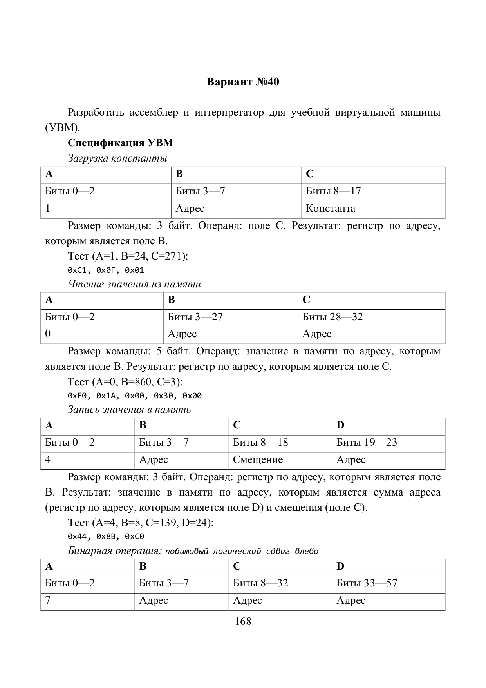
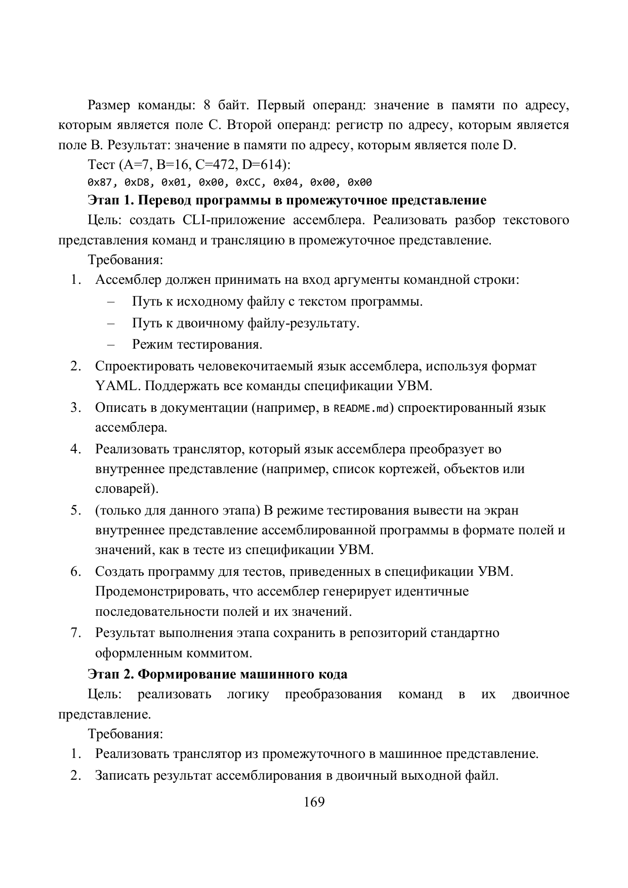
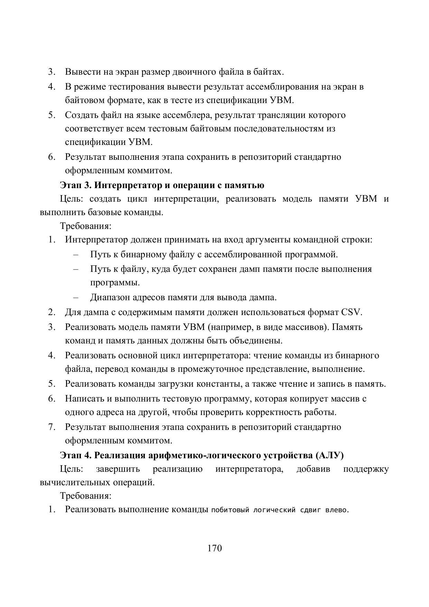
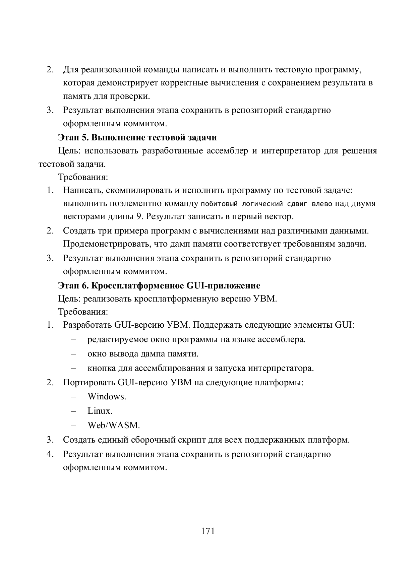

# rcps
Задания с практических работ дисциплины "Разработка кроссплатформенных программных систем"

## 5 занятие
Работа с библиотекой SDL

## 6 занятие
Написание расшифровщиков байткодов CPython и LUA Необходим для решения теста №2

В программе описаны не все операции. Для новой операции достаточно скопировать существующую операцию (add, sub, и т.д.) и поменять знак

## 7 занятие (ОТСУСТВУЕТ ПРИМЕР ПРОГРАММЫ ДЛЯ БАЙТКОДА .NET)
Написание расшифровщиков байткодов JVM и .NET. Необходим для решения теста №3

Для решения теста - вставить в переменную program список операций

В программе описаны не все операции. Для новой операции достаточно скопировать существующую операцию (add, sub, и т.д.) и поменять знак
## 8 занятие
1 этап разработки ассемблера и интерпретатора для учебной виртуальной машины (УВМ)

## 9 Занятие

## 10 Занятие
Выполнение [задач №4, 5, 6, 12](https://github.com/true-grue/kisport/blob/main/pract2.md) 

## 11 Занятие
Создание программ для прохождения тестов 4 и 5

## 12 Занятие
Работа с Lua и C (библиотека SDL)

## 13 Занятие

## 14 Занятие

1-4 Этапы УВМ (40 вариант группы ИКБО-19-22)

Для запуска написать в терминале "python stage_1-2.py prog.yml prog.bin" или "python stage_3-4.py prog.bin prog.csv"

  
  
  
  

